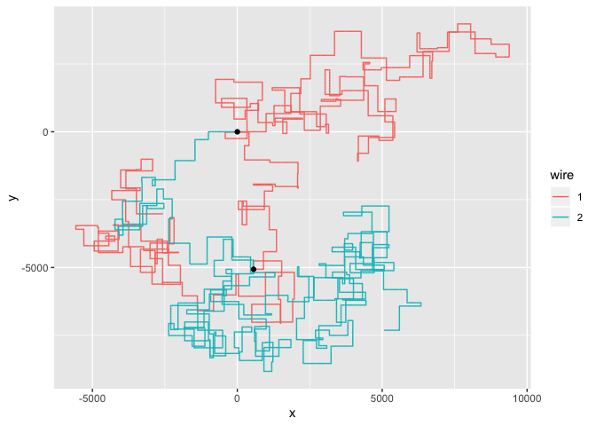

Advent of Code 2019 in R
================
Rasmus Bååth

Advent of Code is a fun creative coding challenge where there is a new
coding challenge each of the 25 day leading up to Christmas. Here are my
solutionions using R. I strive for few lines, clean solutions, and
slooow performance :)

## Day 1 (<https://adventofcode.com/2019/day/1>)

``` r
# Part 1
sum(floor(scan("input/1.txt") / 3) - 2)
```

    ## [1] 3263320

``` r
# Part 2
fuel_requirement <- function(masses) {
  needed_fuels <- pmax(0, (floor(masses / 3) - 2))
  if(all(needed_fuels == 0) ) {
    0
  } else {
    sum(needed_fuels) + fuel_requirement(needed_fuels)
  }
}

fuel_requirement(scan("input/1.txt"))
```

    ## [1] 4892135

## Day 2 (<https://adventofcode.com/2019/day/2>)

``` r
# Part 1
library(tidyverse)

# A Hack to make vectors of the memory class zero indexed
as.memory <- function(x) {
  class(x) <- "memory"
  x
}
`[.memory` <- function(x, i) {
  i <- i + 1
  NextMethod()
}
`[<-.memory` <- function(x, i, value) {
  i <- i + 1
  NextMethod()
}  

make_operator_op <- function(operator) {
  function(memory, p) {
    x1 <- memory[memory[p]]
    x2 <- memory[memory[p + 1]]
    memory[memory[p + 2]] <- operator(x1, x2)
    list(memory = memory, p = p + 3)
  }
}

ops <- list(
  add = make_operator_op(`+`),
  mutl = make_operator_op(`*`)
)

run <- function(memory) {
  state <- list(memory = as.memory(memory), p = 0)
  while(TRUE) {
    opcode <- state$memory[state$p]
    if(opcode == 99) break
    state <- ops[[opcode]](state$memory, state$p + 1)
  }
  state
}

memory <- as.memory(scan("input/2.txt", sep = ","))
memory[1:2] <- c(12, 2)
run(memory)$memory[0]  
```

    ## [1] 4690667

``` r
# Part 2
expand.grid(noun = 0:99, verb = 0:99) %>% 
  mutate(output = map2_dbl(noun, verb , ~ {
    memory[1:2] <- c(.x, .y)
    run(memory)$memory[0] 
  })) %>% 
  filter(output == 19690720) %>% 
  mutate(answer = 100 * noun + verb)
```

    ##   noun verb   output answer
    ## 1   62   55 19690720   6255

## Day 3 (<https://adventofcode.com/2019/day/3>)

``` r
library(tidyverse)
input <- readLines("input/3.txt") %>% 
  str_split(",") %>% 
  map_dfr( ~ tibble(stretch = seq_along(.x), dir_length = .x), .id = "wire") %>% 
  extract(dir_length, c("direction", "length"), "([RUDL])(.+)", convert = TRUE)
input
```

    ## # A tibble: 602 x 4
    ##    wire  stretch direction length
    ##    <chr>   <int> <chr>      <int>
    ##  1 1           1 R            995
    ##  2 1           2 U            671
    ##  3 1           3 R            852
    ##  4 1           4 U            741
    ##  5 1           5 R            347
    ##  6 1           6 U            539
    ##  7 1           7 R            324
    ##  8 1           8 U            865
    ##  9 1           9 R            839
    ## 10 1          10 U            885
    ## # … with 592 more rows

``` r
create_path <- function(input, positions = tibble(x = 0, y = 0)) {
  if(nrow(input) == 0) return(positions)
  direction <- input$direction[1]
  length <- input$length[1]
  x = positions$x[nrow(positions)]
  y = positions$y[nrow(positions)]
  new_positions <- 
    if(direction == "U") {
      tibble(x, y = y + seq_len(length))
    } else if(direction == "D") {
      tibble(x, y = y - seq_len(length)) 
    } else if(direction == "R") {
      tibble(x = x + seq_len(length), y)
    } else {
      tibble(x = x - seq_len(length), y)
    }
  create_path(input[-1, ], rbind(positions, new_positions))
}

wire_paths <- input %>% 
  group_by(wire) %>% 
  group_modify(~ create_path(.x)) %>% 
  mutate(step = row_number() - 1) %>% 
  ungroup()

n_wires = n_distinct(wire_paths$wire)
closest_crossing <- wire_paths %>% 
  filter(x != 0 & y != 0) %>% 
  group_by(x, y) %>% 
  filter(n_distinct(wire) >= n_wires) %>% 
  mutate(distance = abs(x) + abs(y)) %>% 
  arrange(distance) %>% 
  head(1)
closest_crossing
```

    ## # A tibble: 1 x 5
    ## # Groups:   x, y [1]
    ##   wire      x     y  step distance
    ##   <chr> <dbl> <dbl> <dbl>    <dbl>
    ## 1 1       562 -4757 96669     5319

``` r
ggplot(wire_paths, aes(x, y, color = wire)) +
  geom_path() +
  annotate("point", x = 0, y = 0) + 
  annotate("point", x = closest_crossing$x, y = closest_crossing$y)
```

<!-- -->

``` r
# Part 2

closest_crossing <- wire_paths %>% 
  filter(x != 0 & y != 0) %>% 
  group_by(x, y) %>% 
  filter(n_distinct(wire) >= n_wires) %>% 
  group_by(wire, x, y) %>% 
  summarise(step = min(step)) %>% 
  group_by(x, y) %>% 
  summarise(total_steps = sum(step)) %>% 
  arrange(total_steps) %>% 
  head(1)
closest_crossing
```

    ## # A tibble: 1 x 3
    ## # Groups:   x [1]
    ##       x     y total_steps
    ##   <dbl> <dbl>       <dbl>
    ## 1   562 -5065      122514

``` r
ggplot(wire_paths, aes(x, y, color = wire)) +
  geom_path() +
  annotate("point", x = 0, y = 0) + 
  annotate("point", x = closest_crossing$x, y = closest_crossing$y)
```

<!-- -->

## Day 4 (<https://adventofcode.com/2019/day/4>)

``` r
library(tidyverse)

# Part 1
136818:685979 %>% 
  str_split("") %>% 
  map(as.numeric) %>% 
  keep( ~any(rle(.x)$lengths >= 2)) %>% 
  keep( ~all(diff(.x) >= 0)) %>% 
  length()
```

    ## [1] 1919

``` r
# Part 2
136818:685979 %>% 
  str_split("") %>% 
  map(as.numeric) %>% 
  keep( ~any(rle(.x)$lengths == 2)) %>% 
  keep( ~all(diff(.x) >= 0)) %>% 
  length()
```

    ## [1] 1291

## Day 5 (<https://adventofcode.com/2019/day/5>)

## Day 6 (<https://adventofcode.com/2019/day/6>)

``` r
# Part 1
library(igraph)
orbits <- graph_from_data_frame(directed = FALSE,
                                  read.delim("input/6.txt", sep  = ")", header = FALSE))
sum(distances(orbits, to = "COM"))
```

    ## [1] 223251

``` r
# Part 2
distances(orbits, v="YOU",to = "SAN") - 2
```

    ##     SAN
    ## YOU 430

## Day 7 (<https://adventofcode.com/2019/day/7>)

## Day 8 (<https://adventofcode.com/2019/day/8>)

## Day 9 (<https://adventofcode.com/2019/day/9>)

## Day 10 (<https://adventofcode.com/2019/day/10>)

## Day 11 (<https://adventofcode.com/2019/day/11>)

## Day 12 (<https://adventofcode.com/2019/day/12>)

## Day 13 (<https://adventofcode.com/2019/day/13>)

## Day 14 (<https://adventofcode.com/2019/day/14>)

## Day 15 (<https://adventofcode.com/2019/day/15>)

## Day 16 (<https://adventofcode.com/2019/day/16>)

## Day 17 (<https://adventofcode.com/2019/day/17>)

## Day 18 (<https://adventofcode.com/2019/day/18>)

## Day 19 (<https://adventofcode.com/2019/day/19>)

## Day 20 (<https://adventofcode.com/2019/day/20>)

## Day 21 (<https://adventofcode.com/2019/day/21>)

## Day 22 (<https://adventofcode.com/2019/day/22>)

## Day 23 (<https://adventofcode.com/2019/day/23>)

## Day 24 (<https://adventofcode.com/2019/day/24>)

## Day 25 (<https://adventofcode.com/2019/day/25>)
